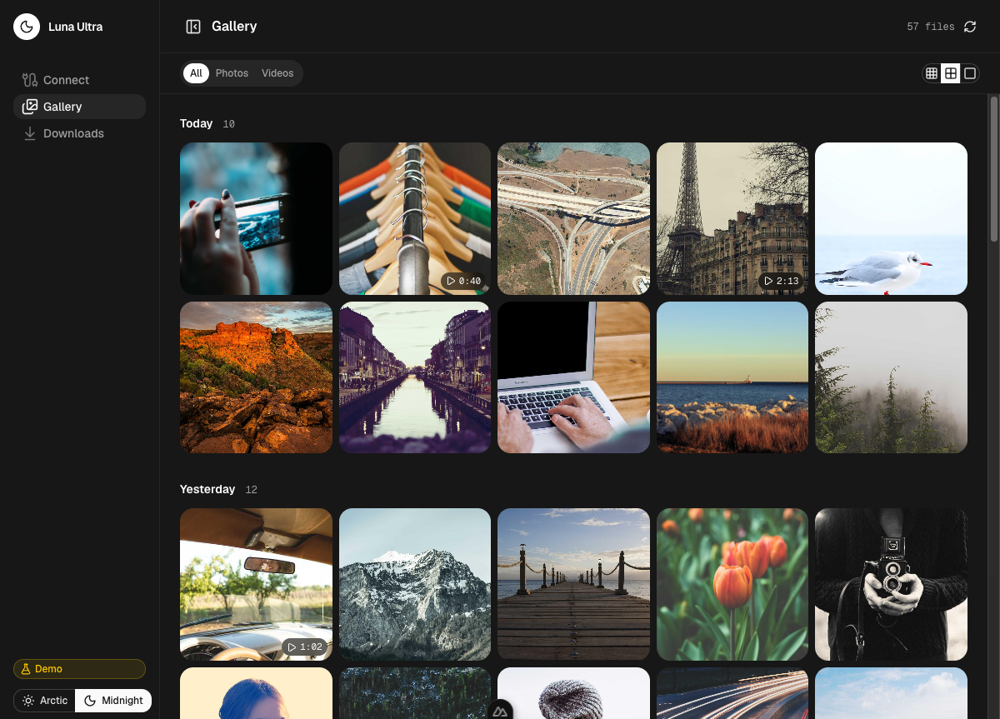
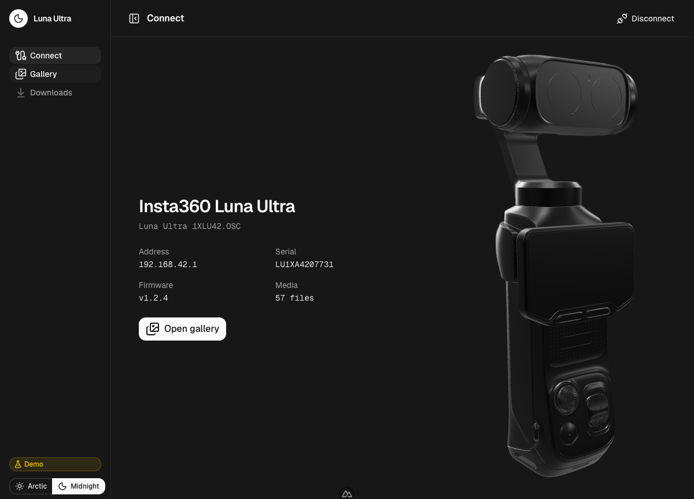
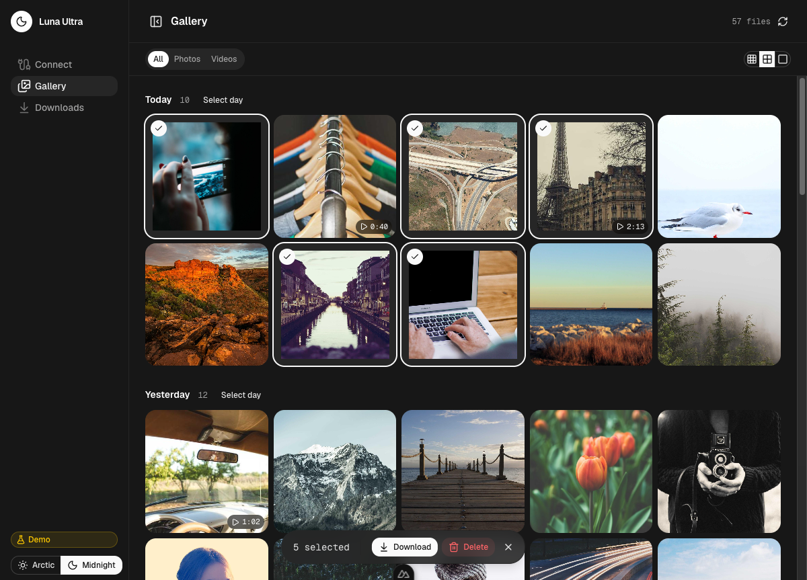
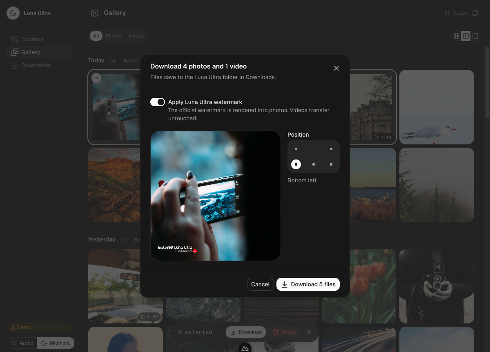
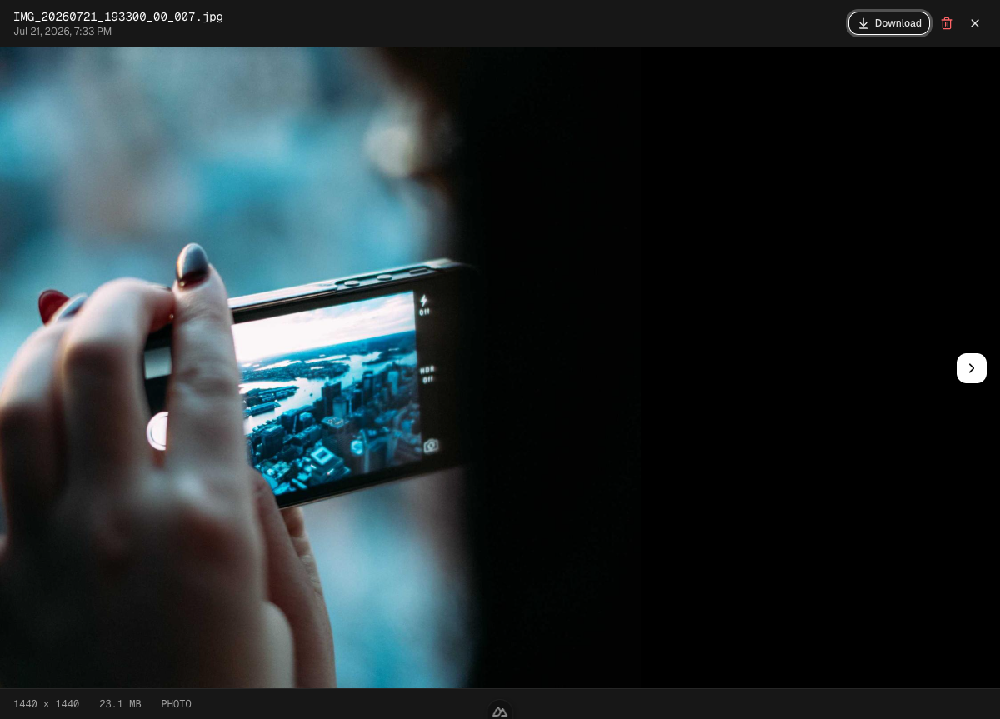
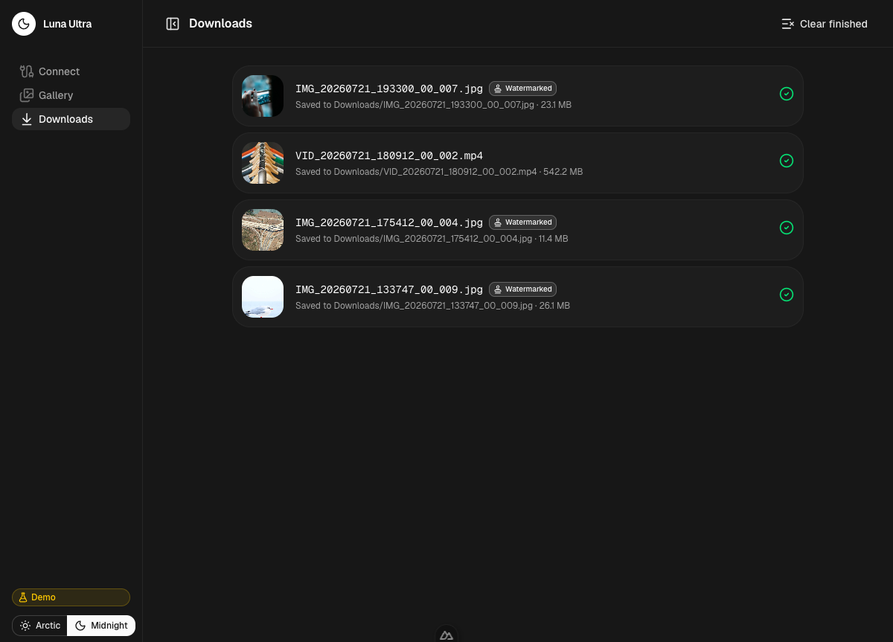
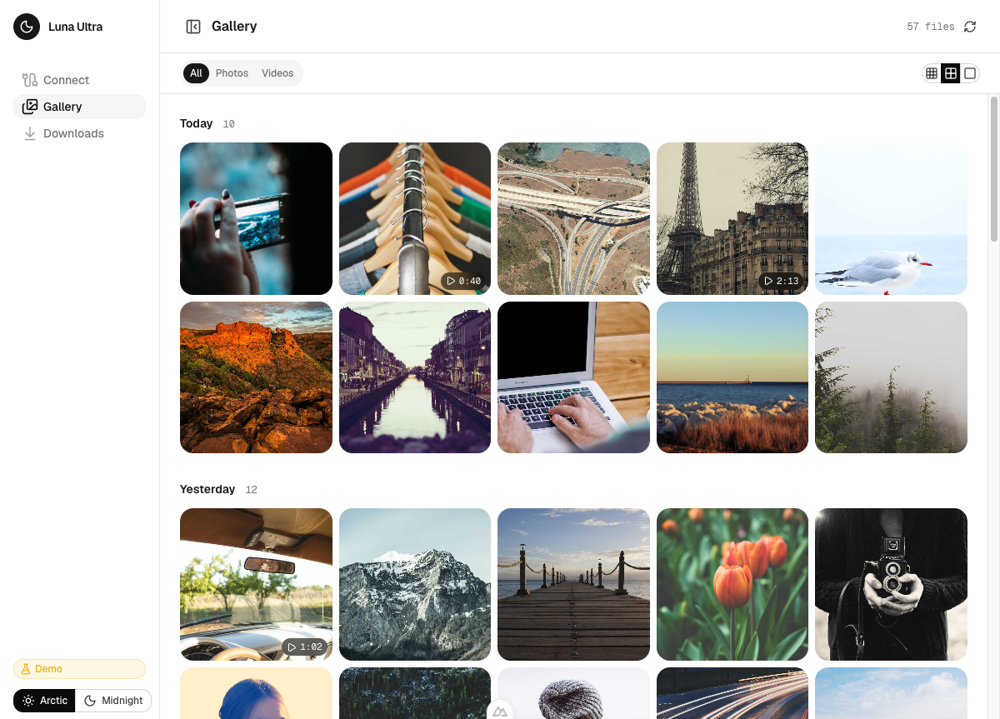

# Luna Ultra Desktop

A desktop companion for the **Insta360 Luna Ultra** camera. Connect over Wi-Fi to browse the camera's media library, batch-download photos and videos with the official Luna Ultra watermark, delete files, and explore the camera as an interactive 3D model.

Built with [Tauri 2](https://v2.tauri.app/), [Nuxt 4](https://nuxt.com/), [Nuxt UI](https://ui.nuxt.com/), and [Three.js](https://threejs.org/). Ships as a native desktop app for macOS, Windows, and Linux with signed auto-updates.

<p align="center">
  
  
</p>

## Features

- **Real camera connection** — pairs with the Luna Ultra over its Wi-Fi network using the camera's own TCP control protocol and HTTP media index. No mock data.
- **Gallery** — date-grouped grid with photo/video filtering, three thumbnail sizes, and a full-screen preview with metadata and keyboard navigation.
- **Multi-select** — click to toggle, shift-click for ranges, per-day select, and select-all. A floating action bar drives downloads and deletes.
- **Downloads** — a background queue with per-file progress, streamed straight from the camera to your Downloads folder.
- **Official watermark** — applies the genuine Insta360 Luna Ultra watermark asset to photos on download, placed per the camera's real aspect-ratio layout table.
- **Delete** — removes files from camera storage over the control channel (permanent, with a confirmation step).
- **3D showpiece** — the camera rendered from its hi-fi 3D scan with orbit controls, in black or white to match the app theme.
- **Two colorways** — Arctic (light) and Midnight (dark), matching the camera's finishes.
- **Auto-updates** — signed delta updates delivered from GitHub Releases.

## Screenshots

| Gallery | Multi-select |
| --- | --- |
|  |  |

| Download + watermark | Full-screen preview |
| --- | --- |
|  |  |

| Downloads queue | Light theme (Arctic) |
| --- | --- |
|  |  |

## How it connects

The Luna Ultra exposes two services on its Wi-Fi network (default gateway `192.168.42.1`):

- **TCP control (port 6666)** — a UCD2-framed binary protocol used for the auth handshake, device info, and delete commands. A live control session also unlocks the HTTP media index.
- **HTTP (port 80)** — an autoindex-style listing of the camera's storage, plus `Range`-capable file downloads.

The control protocol is implemented in Rust (`src-tauri/src/luna.rs`) and exposed to the frontend as Tauri commands; the HTTP index is parsed on the frontend (`app/utils/lunaIndex.ts`). This protocol was reconstructed from the open-source [`diamondfsd/luna-ai-cut`](https://github.com/diamondfsd/luna-ai-cut) project, which also ships the mock camera server vendored here under `luna_mock_server/`.

## Project layout

```
app/                     Nuxt frontend (pages, components, composables, utils)
  composables/useCamera  Connection lifecycle, auto-reconnect
  composables/useGallery Selection, filtering, delete
  composables/useDownloads  Download queue + watermark compositing
  composables/useUpdater Auto-update checker
  utils/lunaClient.ts    Bridge to the Rust commands + HTTP listing
  utils/lunaIndex.ts     Camera HTTP index parser
  utils/watermark*.ts    Official watermark placement engine
src-tauri/src/luna.rs    Luna Ultra TCP control protocol (Rust)
luna_mock_server/        Camera emulator for development and tests
tests/                   Vitest unit tests
screenshots/             Product screenshots
```

## Development

Requires [Bun](https://bun.sh/), [Rust](https://rustup.rs/), and the [Tauri prerequisites](https://v2.tauri.app/start/prerequisites/) for your OS.

```bash
bun install

# Run the full desktop app (Tauri + Nuxt)
bun run dev

# Run just the web frontend in a browser (camera control is unavailable here)
bun run ui:dev
```

> Camera control requires the desktop app — a browser cannot open the raw TCP socket. In `bun run ui:dev` the Connect screen shows a notice explaining this.

### Testing against the mock camera

The vendored `luna_mock_server/` emulates the real Luna Ultra protocol. Point it at a folder of media and connect the app to it:

```bash
node luna_mock_server/server.mjs \
  --root /path/to/media --host 127.0.0.1 --http-port 18080 --tcp-port 6666
```

Then launch `bun run dev` and connect to `127.0.0.1:18080` from the Connect screen.

### Quality checks

```bash
bun x vitest run                                   # frontend unit tests
bun run typecheck                                  # Nuxt/vue-tsc
bun run lint                                       # oxlint
cargo test --manifest-path src-tauri/Cargo.toml    # Rust protocol + integration tests
```

## Building

```bash
bun run build
```

Bundles land in `src-tauri/target/release/bundle/`.

## Releases & auto-updates

Releases are produced by GitHub Actions (`.github/workflows/release.yml`) using [`tauri-action`](https://github.com/tauri-apps/tauri-action). Pushing a version tag builds signed bundles for macOS (Apple Silicon + Intel), Windows, and Linux, publishes a **draft** GitHub Release, and uploads the `latest.json` update manifest.

```bash
# Bump the version in package.json and src-tauri/tauri.conf.json first, then:
git tag v0.1.0
git push origin v0.1.0
```

The app checks for updates on launch and hourly, showing an install prompt in the sidebar when one is available (`app/composables/useUpdater.ts`).

### One-time setup

1. **Create the GitHub repo** and push this project, then update the updater endpoint in `src-tauri/tauri.conf.json` — replace `OWNER` with your GitHub username/org:

   ```json
   "endpoints": ["https://github.com/OWNER/luna-ultra-desktop/releases/latest/download/latest.json"]
   ```

2. **Signing keys.** A keypair has already been generated. The public key is committed in `tauri.conf.json`; the private key is in `src-tauri/luna-ultra-updater.key` and is git-ignored. Add its contents as a repository secret:

   - `TAURI_SIGNING_PRIVATE_KEY` — the full contents of `src-tauri/luna-ultra-updater.key`
   - `TAURI_SIGNING_PRIVATE_KEY_PASSWORD` — the key password (empty for the generated key)

   To rotate the key, run `bun x tauri signer generate -w src-tauri/luna-ultra-updater.key` and paste the new public key into `tauri.conf.json`.

   > **Keep the private key safe.** If it is lost, existing installs can no longer verify updates.

3. Publish a release by pushing a tag (above), then mark the drafted GitHub Release as published.

## Credits

Camera protocol and the official watermark assets are derived from [`diamondfsd/luna-ai-cut`](https://github.com/diamondfsd/luna-ai-cut). Insta360 and Luna Ultra are trademarks of their respective owners; this is an unofficial companion app.
